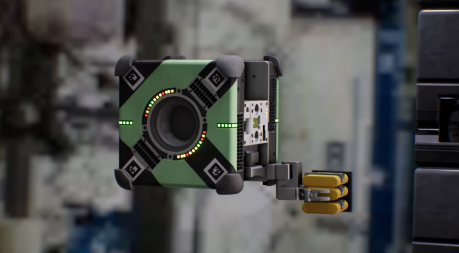

# Space-Robot

 

  
   
  Source: <a href="https://ntrs.nasa.gov/search.jsp?R=20180003515">Fl&uumlckiger et al. (2018)</a>

## Multivariable Adaptive Robust Control for a Free-Flying Space Robot

 - [__Presentation__](https://docs.google.com/presentation/d/e/2PACX-1vRaCu2YRj9ugxywuKAeN9rVocZfMzFz2ddUANwpL8z06-UhulmhlrC-Sr6kVF3h8cVslNI41K3xfBhD/pub?start=true&loop=false&delayms=3000)
